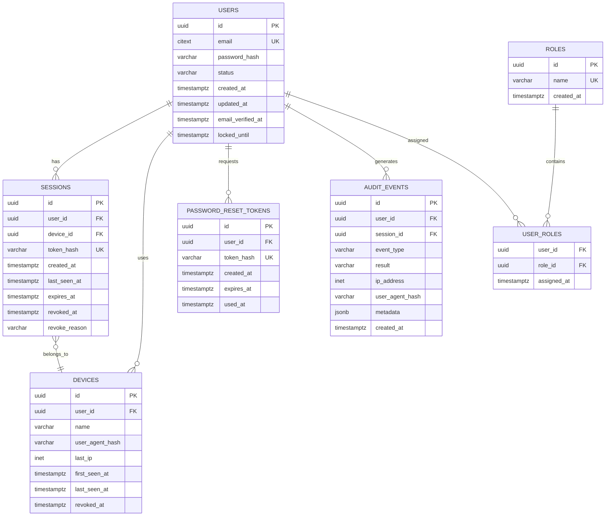

# Modelo de dados

## 1. Objetivo

Definir o modelo relacional inicial do sistema de identidade antes de escrever migrations ou ligar a API ao PostgreSQL.

O modelo deve suportar:

- Utilizadores e estado da conta
- Passwords com hash seguro
- Sessões server-side
- Dispositivos conhecidos
- Recuperação de conta
- Auditoria de segurança
- Roles administrativas futuras

## 2. Diagrama de relações

## 3. Entidades

### 3.1 `users`

Representa a identidade local de uma pessoa.

| Campo | Tipo | Regras |
| --- | --- | --- |
| `id` | UUID | Chave primária, gerado no servidor |
| `email` | CITEXT ou texto normalizado | Obrigatório, único, usado para login |
| `password_hash` | VARCHAR | Obrigatório, Argon2id; nunca guardar a password |
| `status` | ENUM/TEXT | `pending`, `active`, `locked`, `disabled` |
| `email_verified_at` | TIMESTAMPTZ | Nulo até verificação, se essa etapa for ativada |
| `failed_login_count` | INTEGER | Contador controlado pelo servidor |
| `locked_until` | TIMESTAMPTZ | Nulo quando a conta não está temporariamente bloqueada |
| `last_login_at` | TIMESTAMPTZ | Último login aceite |
| `created_at` | TIMESTAMPTZ | Obrigatório, UTC |
| `updated_at` | TIMESTAMPTZ | Obrigatório, atualizado pelo servidor |
| `deleted_at` | TIMESTAMPTZ | Soft delete opcional para retenção e auditoria |

#### Regras

- O email é normalizado antes de comparar ou guardar.
- O email deve ter uma constraint `UNIQUE`.
- `password_hash` nunca aparece em respostas, logs ou auditoria.
- `status = disabled` impede autenticação.
- `status = locked` exige que `locked_until` seja futuro ou que o desbloqueio seja explícito.
- Não apagar fisicamente um utilizador enquanto eventos de auditoria dependerem dele.

### 3.2 `sessions`

Representa uma sessão autenticada do utilizador.

| Campo | Tipo | Regras |
| --- | --- | --- |
| `id` | UUID | Chave primária |
| `user_id` | UUID | FK para `users`, obrigatório |
| `device_id` | UUID | FK para `devices`, opcional na primeira versão |
| `token_hash` | VARCHAR | Obrigatório, único; hash do cookie de sessão |
| `created_at` | TIMESTAMPTZ | Obrigatório |
| `last_seen_at` | TIMESTAMPTZ | Atualizado com controlo de frequência |
| `expires_at` | TIMESTAMPTZ | Expiração absoluta |
| `revoked_at` | TIMESTAMPTZ | Nulo enquanto ativa |
| `revoke_reason` | VARCHAR | Motivo controlado quando revogada |

#### Estados derivados

- **Ativa:** `revoked_at IS NULL` e `expires_at > now()`.
- **Expirada:** `expires_at <= now()`.
- **Revogada:** `revoked_at IS NOT NULL`.

Uma sessão revogada ou expirada nunca pode voltar a ficar ativa.

### 3.3 `devices`

Representa um dispositivo reconhecido pelo utilizador, sem assumir que o dispositivo é confiável.

| Campo | Tipo | Regras |
| --- | --- | --- |
| `id` | UUID | Chave primária |
| `user_id` | UUID | FK para `users` |
| `name` | VARCHAR | Nome apresentado ao utilizador, nunca usar como prova de identidade |
| `user_agent_hash` | VARCHAR | Hash ou resumo técnico, sem guardar mais dados do que o necessário |
| `last_ip` | INET | Último IP observado, sujeito à política de privacidade |
| `first_seen_at` | TIMESTAMPTZ | Obrigatório |
| `last_seen_at` | TIMESTAMPTZ | Obrigatório |
| `revoked_at` | TIMESTAMPTZ | Revoga o dispositivo e as sessões associadas quando aplicável |

O dispositivo é um indicador de contexto, não um segundo fator por si só.

### 3.4 `password_reset_tokens`

Representa pedidos de recuperação de conta.

| Campo | Tipo | Regras |
| --- | --- | --- |
| `id` | UUID | Chave primária |
| `user_id` | UUID | FK para `users` |
| `token_hash` | VARCHAR | Único; guardar apenas o hash do token enviado |
| `created_at` | TIMESTAMPTZ | Obrigatório |
| `expires_at` | TIMESTAMPTZ | Curta duração, definida pela configuração |
| `used_at` | TIMESTAMPTZ | Nulo até consumo; uso único |
| `requested_ip` | INET | Opcional, para auditoria e deteção de abuso |

#### Regras

- Um token só é válido quando `used_at IS NULL` e `expires_at > now()`.
- Consumir o token e alterar a password na mesma transação.
- Invalidar sessões existentes após recuperação bem-sucedida.
- Não incluir o token em logs ou eventos de auditoria.
- Pode existir apenas um token pendente por utilizador; um pedido novo invalida o anterior.

### 3.5 `audit_events`

Regista eventos de segurança e alterações relevantes.

| Campo | Tipo | Regras |
| --- | --- | --- |
| `id` | UUID | Chave primária ou UUID ordenável |
| `user_id` | UUID | FK opcional; pode ser nulo para pedidos desconhecidos |
| `session_id` | UUID | FK opcional |
| `event_type` | VARCHAR/ENUM | Tipo controlado do evento |
| `result` | VARCHAR/ENUM | `success`, `failure` ou `blocked` |
| `ip_address` | INET | Guardar segundo política de retenção |
| `user_agent_hash` | VARCHAR | Resumo técnico sem payload completo |
| `metadata` | JSONB | Apenas dados permitidos e não secretos |
| `created_at` | TIMESTAMPTZ | Obrigatório, UTC |

#### Eventos iniciais

- `user.registered`
- `user.login.succeeded`
- `user.login.failed`
- `user.logout`
- `user.password.changed`
- `password_reset.requested`
- `password_reset.completed`
- `session.created`
- `session.revoked`
- `device.revoked`
- `account.locked`
- `account.unlocked`

A auditoria deve ser append-only para a aplicação. Correções ou retenção devem ser feitas por processos administrativos controlados.

### 3.6 `roles`

Catálogo de roles para autorização futura.

| Campo | Tipo | Regras |
| --- | --- | --- |
| `id` | UUID | Chave primária |
| `name` | VARCHAR | Único, por exemplo `user` e `admin` |
| `created_at` | TIMESTAMPTZ | Obrigatório |

A role não deve ser recebida diretamente do cliente nem inferida a partir do email.

### 3.7 `user_roles`

Tabela de relação entre utilizadores e roles.

| Campo | Tipo | Regras |
| --- | --- | --- |
| `user_id` | UUID | FK para `users` |
| `role_id` | UUID | FK para `roles` |
| `assigned_at` | TIMESTAMPTZ | Obrigatório |

Chave primária composta por `user_id` e `role_id`.

## 4. Constraints e integridade

- Todas as chaves estrangeiras usam UUID e têm índices adequados.
- `users.email` e todos os tokens hash têm unicidade.
- Datas são sempre guardadas em UTC.
- `expires_at` deve ser posterior a `created_at`.
- `used_at` e `revoked_at` não podem ser anteriores a `created_at`.
- `failed_login_count` nunca pode ser negativo.
- Apagar um utilizador deve ser restrito ou seguir uma política explícita de retenção.
- A aplicação não pode alterar diretamente eventos de auditoria já criados.
- Campos de estado devem aceitar apenas valores documentados.

## 5. Índices

Índices mínimos:

- `users(email)` unique
- `users(status)`
- `sessions(token_hash)` unique
- `sessions(user_id, revoked_at, expires_at)`
- `sessions(device_id)`
- `devices(user_id, revoked_at)`
- `password_reset_tokens(token_hash)` unique
- `password_reset_tokens(user_id, used_at, expires_at)`
- `audit_events(user_id, created_at DESC)`
- `audit_events(event_type, created_at DESC)`
- `audit_events(ip_address, created_at DESC)`
- `user_roles(role_id)`

Para grandes volumes, `audit_events` pode ser particionada por mês depois de medir a necessidade.

## 6. Retenção e privacidade

- Sessões expiradas podem ser limpas por job depois do período necessário para auditoria.
- Tokens de recuperação usados ou expirados devem ser removidos após a retenção mínima.
- Logs de IP e user agent devem ter prazo de retenção definido.
- A eliminação de uma conta deve preservar apenas o necessário para obrigações legais e segurança.
- Backups devem ser encriptados e ter controlo de acesso separado.

## 7. Transações obrigatórias

### Registo

Criar utilizador, dados iniciais e evento `user.registered` na mesma transação quando possível.

### Login

Atualizar dados de login, criar sessão e registar o resultado do login de forma consistente.

### Recuperação

Marcar token como usado, alterar `password_hash`, invalidar sessões e criar eventos numa transação.

### Revogação

Marcar a sessão ou dispositivo como revogado e criar o evento correspondente na mesma transação.

## 8. Decisões adiadas

- Verificação obrigatória de email.
- Tabela específica para fatores MFA.
- Identidades OAuth e contas externas.
- Multi-tenancy.
- Particionamento de auditoria.
- Estratégia de anonimização após eliminação de conta.
- Separação física da auditoria numa base de dados própria.

Estas decisões não devem alterar as entidades base sem uma nova revisão de arquitetura.

## 9. Critérios de aceitação

O modelo está pronto para virar migrations quando:

- Todas as entidades tiverem campos, estados e relações definidos.
- As regras de unicidade e expiração estiverem cobertas por constraints ou serviços.
- Os índices mínimos estiverem identificados.
- Não existir nenhum campo para guardar passwords ou tokens em texto simples.
- A política de retenção estiver definida para sessões, tokens e auditoria.
- O contrato da API puder referenciar IDs e estados deste modelo sem ambiguidades.
